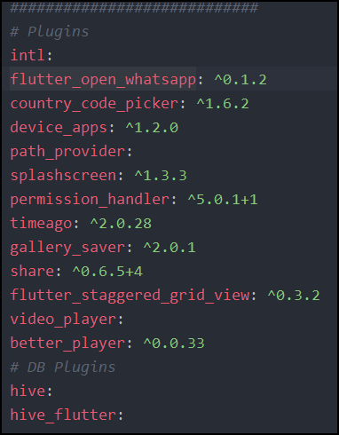

  
  <h3 align="center">Unknown Messenger</h3>
  

    Unknown Messenger app with Flutter that use to send message to number which is not saved in contact list of WhatsApp
     
    <!-- <a href="https://github.com/Ismaestro/flutter-example-app/issues/new">Report bug</a>
    ·
    <a href="https://github.com/Ismaestro/flutter-example-app/issues/new">Request feature</a> -->
  

## Table of contents

- [Table of contents](#table-of-contents)
- [Quick start](#quick-start)
- [What's included](#whats-included)
- [Hive](#hive)
- [Packages](#packages)
- [Screenshots](#screenshots)
- [Creators](#creators)
- [Thanks!](#thanks)

## Quick start

This is a normal flutter app. You should follow the instructions in the [official documentation](https://flutter.io/docs/get-started/install).

## What's included

- Check weather WhatsApp is install or Not
- Attractive UI
- Search Country Code
- CRUD with HIVE!
- Show History of Numbers
- Clear History
- Saved Images and Videos in Gallery
- Share Images and Videos

## Hive

This repo is using Hive (noSQL, Persistence DB) to save data locally on user device for security reason, It shows the list of entered number by user with message and time when message sent.

## Packages

List of packages are used to make this app

## Screenshots

## Creators

**Pruthvi Soni**

- <https://github.com/PruthviSooni>

<!--  -->

## Thanks!

Enjoy :metal:
